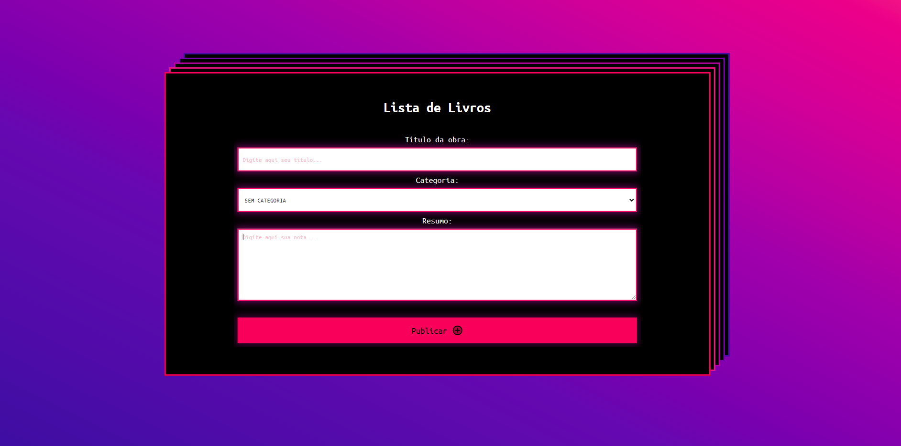
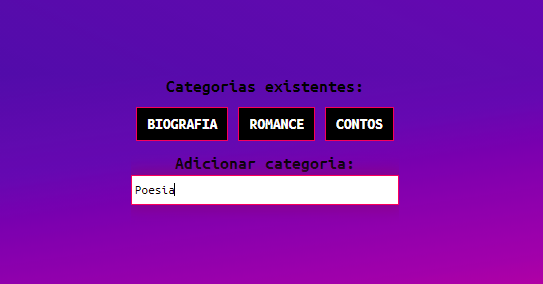
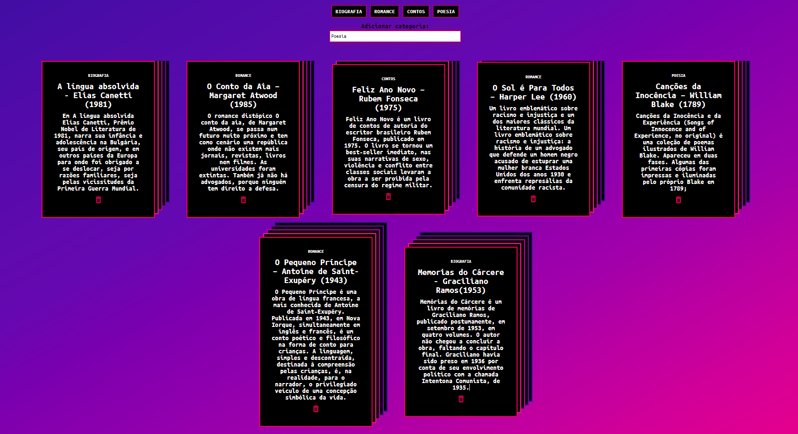

# React Book List

<h1 align="center">React Book List</h1>

This is a responsive project

inspired by <a href="https://github.com/alura-cursos/1841-react-observable">Formação React Alura</a>

### Features

- [X] Create book item list
- [X] Delete book item list
- [X] Delete category
- [X] Create category
- [ ] Database
- [ ] Form input validation
- [ ] Translate to English
- [ ] Observable React Pattern

<h1 align="center">
  
  
  
</h1>
